# pixel

Este projeto é um estudos que realizei alguns anos atrás.
Entre as referências que utilizei está o livro Digital Image Processing 4e (Rafael C. Gonzalez, Richard E. Woods) e o projeto [FastImageEx](https://sourceforge.net/projects/fastimageex/).

Você pode inicar a documentação pelo [docs/pt-BR/pixel.md](docs/pt-BR/pixel.md).

> [!WARNING]
> Como é um projeto de estudo, não é aconselhavel utilizar em ambientes de produção.

<!--

-->

## Exemplos

### Segmentação

O [RLESegmentation](docs/pt-BR/RLE.md) (Run-Length-Encoding Segmentation) é um metodo de [segmentação de imagem](https://en.wikipedia.org/wiki/Image_segmentation) basedo no projeto [FastImageEx](https://sourceforge.net/projects/fastimageex/).

Veja o exemplo em [/docs/examples/rle-segmentation/](docs/examples/rle-segmentation/).

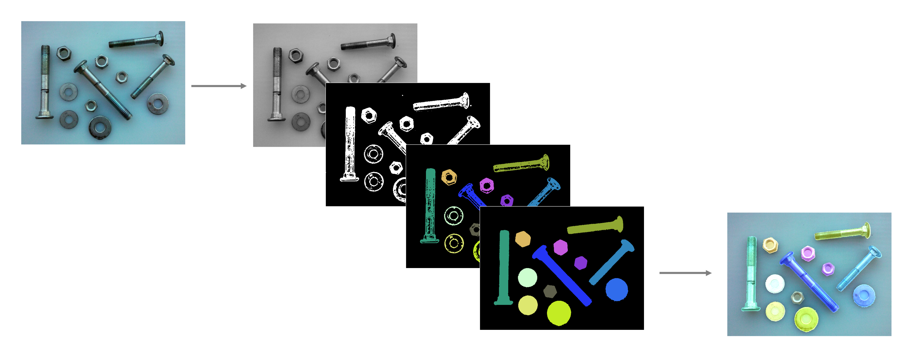

> [!NOTE]
> A imagem é uma ilustração abreviada das etapas necessarias para realizar a segmentação, veja o exemplo para mais informações.

### Clahe 

O [Clahe](https://en.wikipedia.org/wiki/Adaptive_histogram_equalization) está disponivel nas classes [ColorImageData](docs/pt-BR/ColorImageData.md) e [GrayImageData](docs/pt-BR/GrayImageData.md).

Veja o exemplo em [/docs/examples/clahe/](docs/examples/clahe/).

#### RGB Image

| Input | Output |
|-------|--------|
| 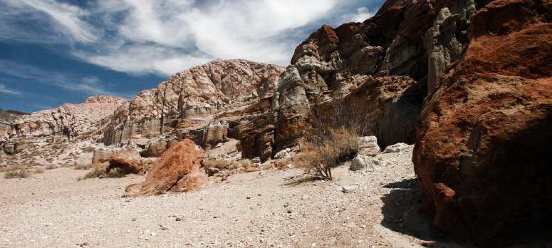 | 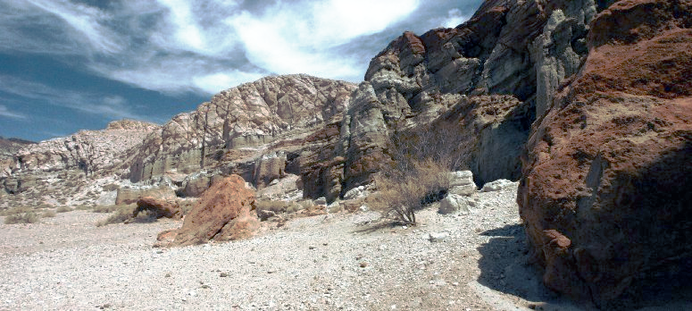 |
| 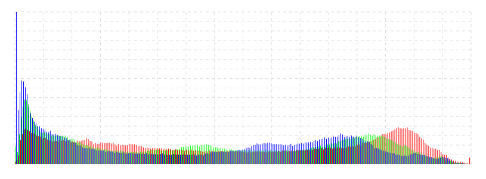 | 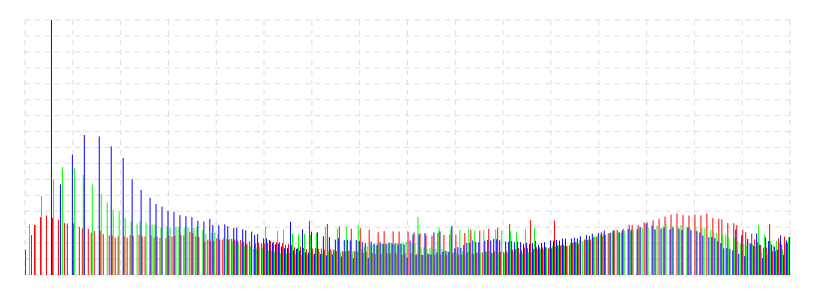 |

#### Gray Image

| Input | Output |
|-------|--------|
| 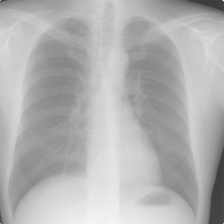 | 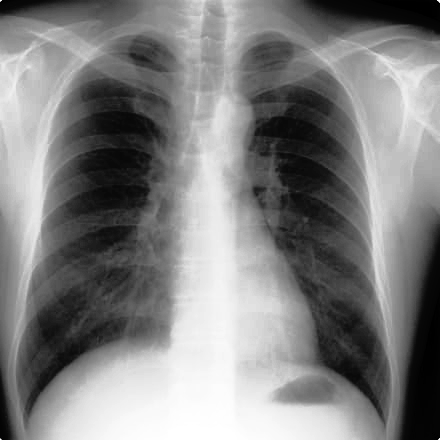 |
| 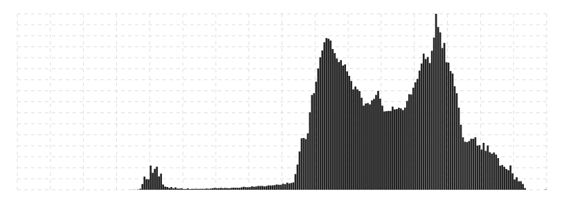 | 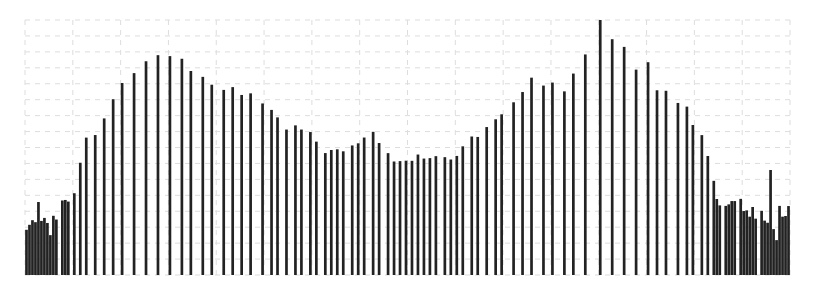 |

### Binary 

As operações com [Imagens binárias](https://en.wikipedia.org/wiki/Binary_image) estão disponiveis com a classe [BinaryImageData](docs/pt-BR/BinaryImageData.md).

Veja o exemplo em [/docs/examples/binary/](docs/examples/binary/).

| **Operation**    | Input | Output |
|------------------|-------|--------|
| Remove noise     |  | 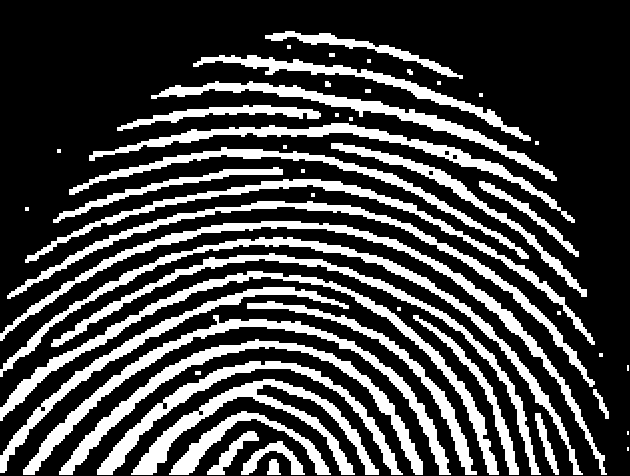 |
| Extract Boundary | 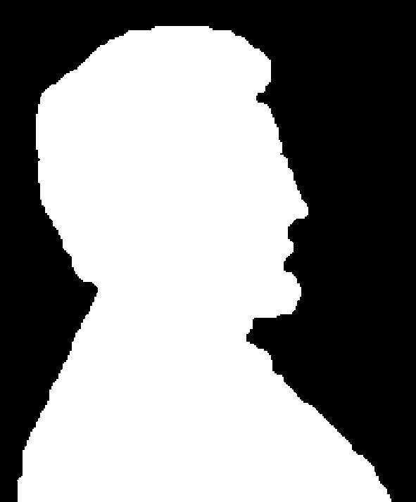 | 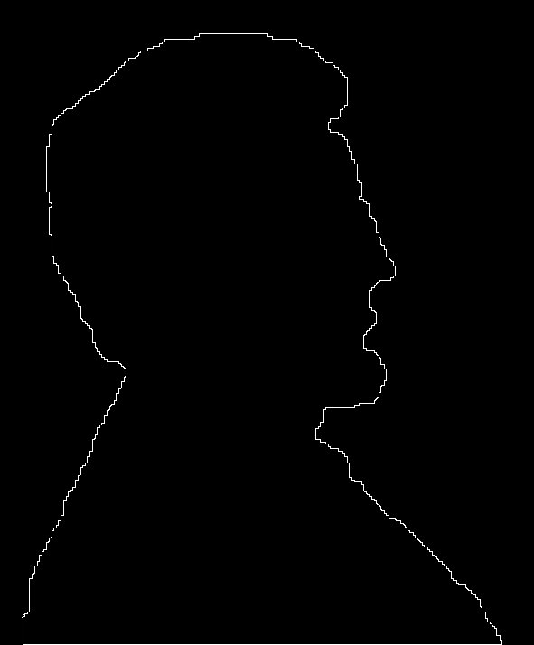 |
| Fill Holes       |  | 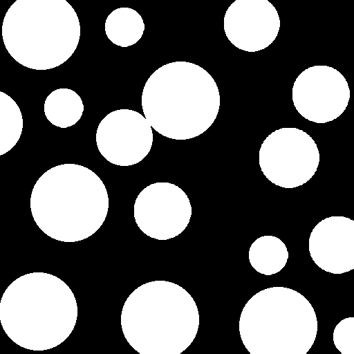 |
| Thinning         | 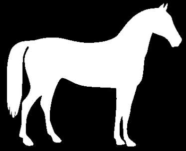     |  |

<!-- -- >

### Open Circle

Embora não seja um metodo implementado, realizei um teste de "abrir um circulo" no exeplo [/docs/examples/open-circle/](docs/examples/open-circle/).

| 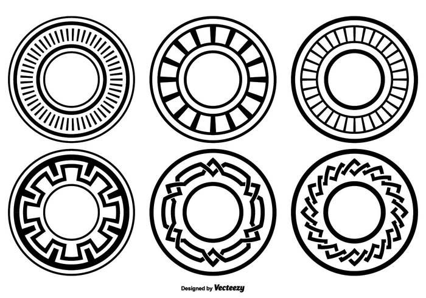 |
|:-:|
|  |
|  |
|  |
|  |
|  |
|  |

| 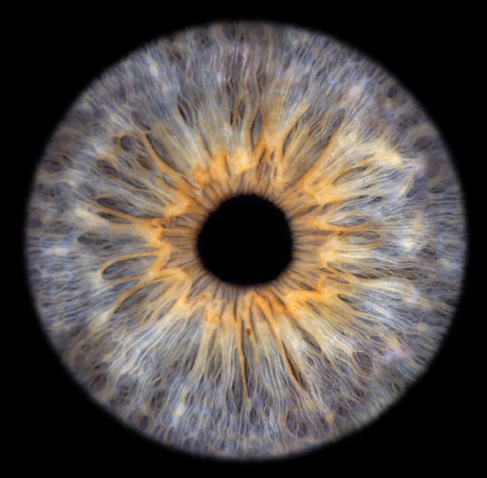 |
|:-:|
|  |

<!-- -->

## Instruções

Você pode fazer o download ZIP ou clonar o repositório utilizando o git.
E para visualizar os exemplos de [docs/examples](docs/examples/), 
será preciso iniciar um servidor local, no exmplo a seguir utilizamos o python para iniciar um servidor simples.
Em seguida, abra o localhost em um browser.

```
git clone https://github.com/devConcordia/pixel.git

cd pixel

python -m http.server
```

> [!NOTE]
> Observe que nos exemplos, definimos o `style` dos canvas com `image-rendering: pixelated`.
> Isso altera a visualização da imagem de modo que ela fique mais "quadriculada".


