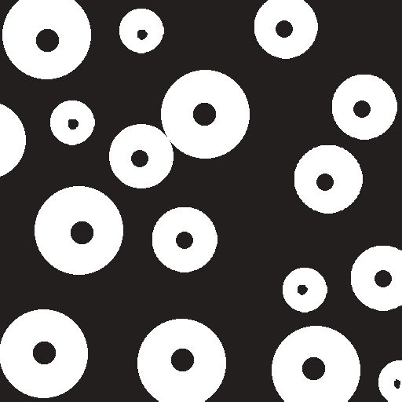
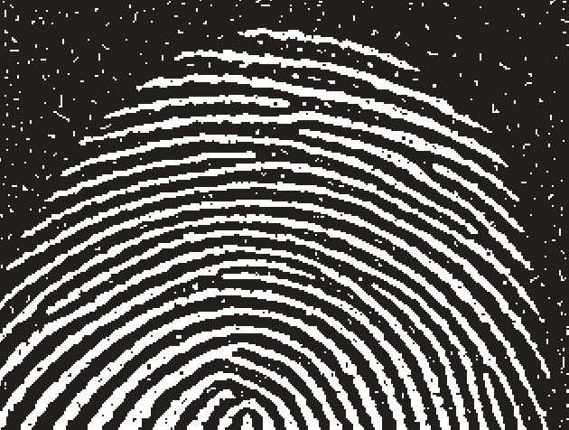

# BinaryImageData

Com a classe [BinaryImageData](../../source/BinaryImageData.mjs), cada pixel é repesentado por um bit, ou seja, preto e braco.

## Índice

**Métodos básicos**
- [clone](#clone)
- [get](#get)
- [set](#set)
- [getImageData](#getImageData)
- [equals](#equals)
- [countNonZero](#countNonZero)
- [toString](#toString)

**Bitwise**
- [and](#and)
- [or](#or)
- [xor](#xor)
- [not](#not)

**Morfologia**
- [erode](#erode)
- [dilate](#dilate)
- [open](#open)
- [close](#close)
- [hitOrMiss](#hitOrMiss)
- [boundary](#boundary)
- [flood](#flood)
- [fillHoles](#fillHoles)
- [thinning](#thinning)

## Constructor

Seguindo o padrão do [ImageData](https://developer.mozilla.org/en-US/docs/Web/API/ImageData/ImageData), o [BinaryImageData]() pode ser inciado dos seguintes modos

``` javascript

new BinaryImageData(width, height)

new BinaryImageData(dataArray, width)
new BinaryImageData(dataArray, width, height)

```

Sendo `width` e `height` do tipo [Number](https://developer.mozilla.org/en-US/docs/Web/JavaScript/Reference/Global_Objects/Number),
e `dataArray` do tipo [Uint8Array](https://developer.mozilla.org/en-US/docs/Web/JavaScript/Reference/Global_Objects/Uint8Array).

### Propriedades de instâcia

| Propriedade | Tipo | Descrição |
|-------------|------|-----------|
| width       | [Number](https://developer.mozilla.org/en-US/docs/Web/JavaScript/Reference/Global_Objects/Number) | Um valor inteiro indicando a quantidade de colunas da imagem. |
| height      | [Number](https://developer.mozilla.org/en-US/docs/Web/JavaScript/Reference/Global_Objects/Number) | Um valor inteiro indicando a quantidade de linhas da imagem. |
| data        | [Uint8Array](https://developer.mozilla.org/en-US/docs/Web/JavaScript/Reference/Global_Objects/Uint8Array) | Os valores de cada um dos pixeis da imagem. Observe que cada bit representa um pixel, ou seja, a cada byte há 8 pixeis. |

> [!NOTE]
> `data` é um [Uint8Array](https://developer.mozilla.org/en-US/docs/Web/JavaScript/Reference/Global_Objects/Uint8Array) pois em aguns cálculos (como deslocamento a esquerda) podem fazer o valor ultrapassar o limite `255` e alterar todos os pixeis desse byte. 

## Métodos estáticos

### From

Inicia [BinaryImageData]() a partir de um [ImageData](https://developer.mozilla.org/en-US/docs/Web/API/ImageData) ou [GrayImageData](GrayImageData.md).

| Argumento | Tipo | Descrição |
|-----------|------|-----------|
| input     | [ImageData](https://developer.mozilla.org/en-US/docs/Web/API/ImageData) | Imagem original |
| options   | [Object](https://developer.mozilla.org/en-US/docs/Web/JavaScript/Reference/Global_Objects/Object) | Opções para iniciar o [GrayImageData]() |


## Métodos de instâcia

### and

Realiza a operação binária [AND](https://en.wikipedia.org/wiki/Bitwise_operation#AND) entre duas imagens binárias.

| Argumento | Tipo | Descrição |
|-----------|------|-----------|
| input     | [BinaryImageData]() | Segunda imagem para relaizar a operação. **Ambas imagens devem possuir as mesmas dimensões**. |

#### Retorno

Uma nova [BinaryImageData]() com as mesmas dimenões.

----

### boundary

Extrai o contorno dos obejtos em uma imagem.

#### Retorno

Uma nova [BinaryImageData]() com as mesmas dimenões.


----

### clone

Cria uma nova instância de [BinaryImageData]() com as mesmas dimenões e valores.

#### Retorno

Uma nova [BinaryImageData]().

----

### close

O [Fechamento](https://en.wikipedia.org/wiki/Closing_(morphology)) é uma operação de morfologia, da qual realiza a [dilatação](#dilate) seguida de [erosão](#erode).

Pode ser utilizada para preencher pequenos buracos e conectar regiões próximas, **fechando** espaços dentro de objetos e suavizando contornos.

| Argumento | Tipo | Descrição |
|-----------|------|-----------|
| matrix    | [Matrix](Matrix.md) | Uma matriz que define a estrutura da operação (Quadrado, Cruz, Círculo) |

#### Retorno

O retorno é uma nova instâcia ([BinaryImageData]()).

----

### countNonZero

Realiza a contagem de pixeis brancos.

#### Retorno

Retorna um [Number](https://developer.mozilla.org/en-US/docs/Web/JavaScript/Reference/Global_Objects/Number).

----

### dilate

A [dilatação](https://en.wikipedia.org/wiki/Dilation_(morphology)) é uma operação em morfologia, da qual expande regiões claras, tornando os objetos maiores.

| Argumento | Tipo | Descrição |
|-----------|------|-----------|
| matrix    | [Matrix](Matrix.md) | Uma matriz que define a estrutura da ooperação (Quadrado, Cruz, Círculo) |

#### Retorno

O retorno é uma nova instâcia [BinaryImageData]().

----

### equals

Compara duas [BinaryImageData]()

#### Retorno

Retorna um [Boolean](https://developer.mozilla.org/en-US/docs/Web/JavaScript/Reference/Global_Objects/Boolean).

----

### erode

A [erosão](https://en.wikipedia.org/wiki/Erosion_(morphology)) é uma operação em morfologia, da qual reduz as regiões claras, tornando os objetos menores.

| Argumento | Tipo | Descrição |
|-----------|------|-----------|
| matrix    | [Matrix](Matrix.md) | Uma matriz que define a estrutura da operação (Quadrado, Cruz, Círculo) |

#### Retorno

O retorno é uma nova instâcia ([BinaryImageData]()).

----

### fillHoles

Preenche os buracos presentes na imagem.

| Antes | Depois |
|:-:|:-:|
|  |  |

#### Retorno

Uma nova [BinaryImageData]() com as mesmas dimenões.

----

### flood

Preenche toda uma região de pixeis vizinhos a partir de um ponto `x, y`.

| Argumento | Tipo | Descrição |
|-----------|------|-----------|
| x         | [Number](https://developer.mozilla.org/en-US/docs/Web/JavaScript/Reference/Global_Objects/Number) | Posição `x` do pixel inicial. |
| y         | [Number](https://developer.mozilla.org/en-US/docs/Web/JavaScript/Reference/Global_Objects/Number) | Posição `y` do pixel inicial. |

#### Retorno

Uma nova [BinaryImageData]() com as mesmas dimenões.

----

### get

Obtem o valor de um pixel na posição `x, y`.

| Argumento | Tipo | Descrição |
|-----------|------|-----------|
| x         | [Number](https://developer.mozilla.org/en-US/docs/Web/JavaScript/Reference/Global_Objects/Number) | Posição `x` do pixel |
| y         | [Number](https://developer.mozilla.org/en-US/docs/Web/JavaScript/Reference/Global_Objects/Number) | Posição `y` do pixel |

#### Retorno

Retorna um [Number](https://developer.mozilla.org/en-US/docs/Web/JavaScript/Reference/Global_Objects/Number) (`0` ou `1`).

----

### getImageData

Como [BinaryImageData]() possui somente um canal, é necessário converter em [ImageData](https://developer.mozilla.org/en-US/docs/Web/API/ImageData) para ser renderizado.

#### Retorno

O retorno é um [ImageData](https://developer.mozilla.org/en-US/docs/Web/API/ImageData).

----

### hitOrMiss

O [HitOrMiss](https://en.wikipedia.org/wiki/Erosion_(morphology)) é uma operação em morfologia, da qual reduz as regiões claras, tornando os objetos menores.

| Antes | Depois |
|:-:|:-:|
|  |  |

| Argumento | Tipo | Descrição |
|-----------|------|-----------|
| matrix    | [Matrix](Matrix.md) | Uma matriz que define a estrutura da operação (Quadrado, Cruz, Círculo) |

#### Retorno

O retorno é uma nova instâcia ([BinaryImageData]()).

----

### not

Realiza a operação binária [NOT](https://en.wikipedia.org/wiki/Bitwise_operation#NOT) entre duas imagens binárias.

#### Retorno

Uma nova [BinaryImageData]() com as mesmas dimenões.

----

### open

A [abertura](https://en.wikipedia.org/wiki/Opening_(morphology)) é uma operação de morfologia, da qual realiza a [erosão](#erode) seguida de [dilatação](#dilate).

Pode ser utilizada usada para remover ruídos e suavizar contornos sem afetar significativamente o tamanho dos objetos principais.

| Argumento | Tipo | Descrição |
|-----------|------|-----------|
| matrix    | [Matrix](Matrix.md) | Uma matriz que define a estrutura da operação (Quadrado, Cruz, Círculo) |

#### Retorno

O retorno é uma nova instâcia ([BinaryImageData]()).

----

### or

Realiza a operação binária [OR](https://en.wikipedia.org/wiki/Bitwise_operation#OR) entre duas imagens binárias.

| Argumento | Tipo | Descrição |
|-----------|------|-----------|
| input     | [BinaryImageData]() | Segunda imagem para relaizar a operação. **Ambas imagens devem possuir as mesmas dimensões**. |

#### Retorno

Uma nova [BinaryImageData]() com as mesmas dimenões.

----

### set

Define o valor de um pixel na posição `x, y`.

| Argumento | Tipo | Descrição |
|-----------|------|-----------|
| x         | [Number](https://developer.mozilla.org/en-US/docs/Web/JavaScript/Reference/Global_Objects/Number) | Posição `x` do pixel. |
| y         | [Number](https://developer.mozilla.org/en-US/docs/Web/JavaScript/Reference/Global_Objects/Number) | Posição `y` do pixel. |
| v         | [Number](https://developer.mozilla.org/en-US/docs/Web/JavaScript/Reference/Global_Objects/Number) | Valor do pixel. Sendo `0` ou `1`. |

#### Retorno

Retorna a instância [BinaryImageData]().

----

### thinning

O [Thinning](https://en.wikipedia.org/wiki/Thinning_(morphology)) é uma técnica que reduz a espessura dos objetos, representando somente as linhas centrais.

| Antes | Depois |
|:-:|:-:|
|  |  |

| Argumento | Tipo | Descrição |
|-----------|------|-----------|
| matrix    | [Matrix](Matrix.md) | Uma matriz que define a estrutura da operação (Quadrado, Cruz, Círculo) |

#### Retorno

O retorno é uma nova instâcia ([BinaryImageData]()).

----

### toString

É possivel transformar a imagem em texto, de forma que os caracteres imitem um gradiente de tons de cinza.

#### Retorno

O retorno é uma [String](https://developer.mozilla.org/en-US/docs/Web/JavaScript/Reference/Global_Objects/String).

----

### xor

Realiza a operação binária [XOR](https://en.wikipedia.org/wiki/Bitwise_operation#XOR) entre duas imagens binárias.

| Argumento | Tipo | Descrição |
|-----------|------|-----------|
| input     | [BinaryImageData]() | Segunda imagem para relaizar a operação. **Ambas imagens devem possuir as mesmas dimensões**. |

#### Retorno

Uma nova [BinaryImageData]() com as mesmas dimenões.


